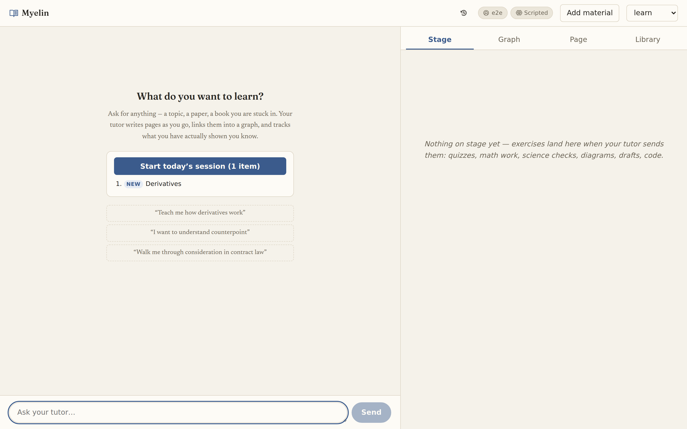
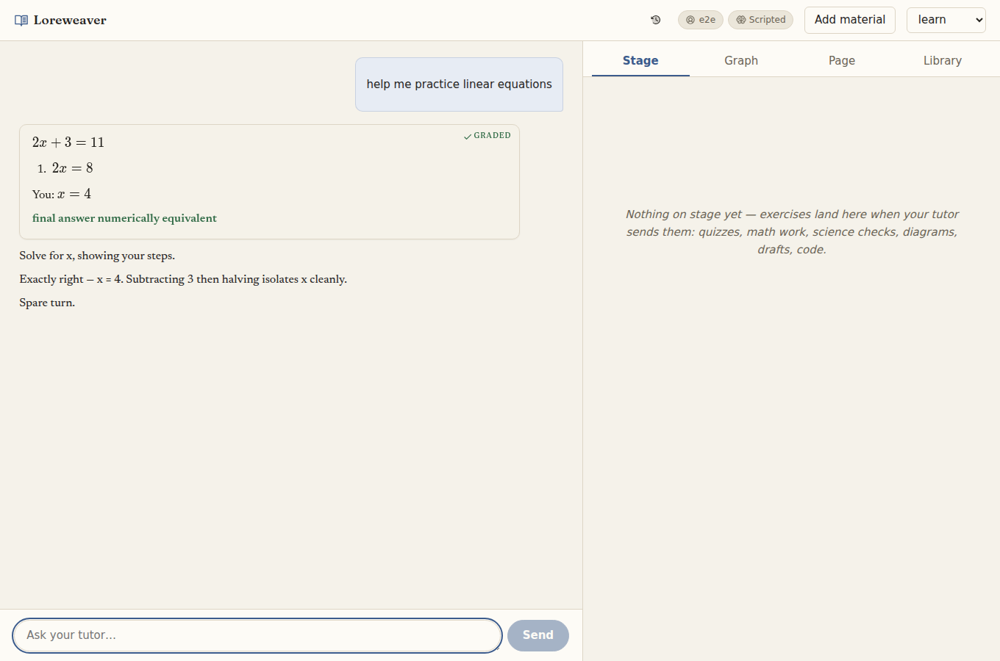
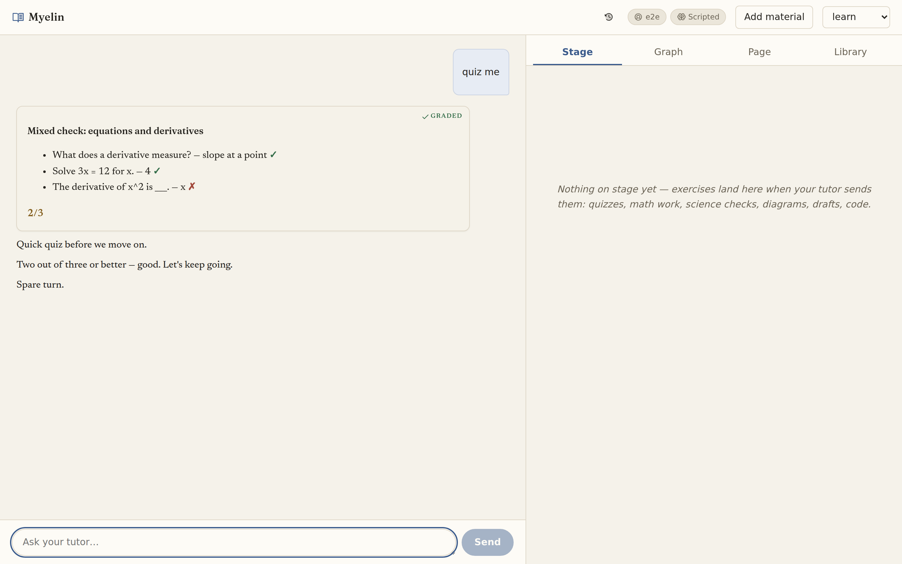
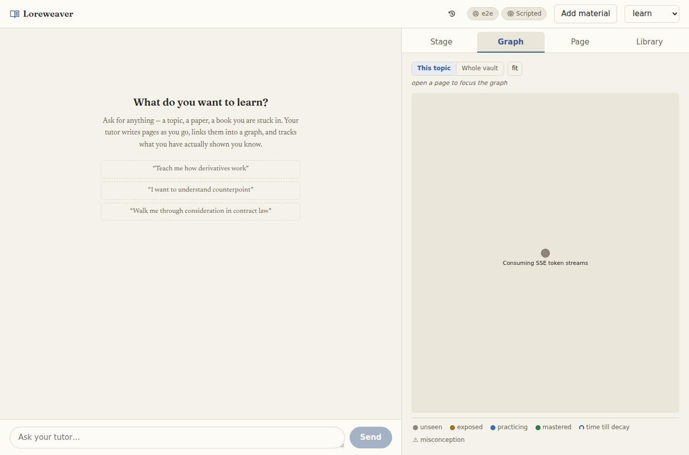

<div align="center">

# Myelin

**A learn-anything desktop tutor that refuses to lie about what you know.**

[](https://github.com/SabienNguyen/myelin/actions/workflows/ci.yml)

*Repeated use myelinates a pathway — recall gets faster and more durable; leave it alone and it thins and fades. This app is built on that one fact.*

</div>

Myelin is a chat tutor that teaches through graded interactive blocks, a mastery graph that tracks
what you have actually **proven**, and an evidence guardrail that keeps the two honest: nothing
counts as learned without being graded and recorded, and a model's opinion can never mint the
evidence a machine check earns. Long-term memory lives in
**[Engram](https://github.com/SabienNguyen/engram)** — an MCP teaching-memory server that is the
*only* writer of your notes and student files, reached exclusively over stdio MCP.

## A guided tour

**Ask for anything.** No syllabus to choose, no deck to build — say what you want to learn, and the
tutor writes the pages as you go and links them into a graph.



**Every answer is graded by a machine, not a vibe.** The step-aware math scratchpad (MathLive entry)
is checked by *numeric equivalence*, so any algebraically-correct form passes — and the verdict says
exactly why.



**A miss stays a miss.** Quizzes mark every item mechanically and never round up — the score is the
truth, and a ✗ stays a ✗.



**A map of what you’ve proven.** The mastery graph colours every page by the level you’ve *earned*
and decays it over time, so the picture moves down as well as up.

<p align="center">
  
</p>

## Why it's different

- **Every subject gets an applied check.** Mechanical checkers for science and structured answers
  (numeric/unit algebra, chemical equations, sets, sequences, matching, note arithmetic), a
  step-aware math scratchpad (MathLive entry, numeric-equivalence grading that understands
  equation chains), diagram labelling for picture subjects, microphone tone-pronunciation grading
  for spoken languages, writing drafts checked two ways — mechanical grammar/style linting in the
  browser via [Harper](https://writewithharper.com/) (WASM, no model, runs as you type with
  one-click fixes) *and* a model rubric on the argument — with a one-click revise round, and a
  built-in
  **code sandbox**: exercise ladders, generated exercises
  behind a review gate, and whole-program judging in ten runtimes (node, TypeScript, python3,
  bash, ruby, sqlite, C, Rust, CUDA where a toolkit exists; Go/Java via Docker) plus
  compose-backed service environments (redis, postgres).
- **Your material is the curriculum.** One *Add material* control ingests books and papers
  (PDF/EPUB/DOCX/MD), git repos (functions mined into exercises with your approval), YouTube
  lectures (the video's own captions become a timestamped, deep-linked transcript — needs
  `yt-dlp`, no video download), and problem sets or past exams — banked and drilled **verbatim**,
  never paraphrased. A source reader opens any artifact beside the conversation; select a passage
  to ask about it.
- **The tutor is a librarian first.** Live literature search (newest and most-cited), citation
  chasing through an ingested paper's own references, and prompt rules that route learning through
  real human artifacts — research claims must match what was actually read.
- **Languages get to be heard, typed, and spoken back.** For tone languages especially
  (Vietnamese, Mandarin) the tutor attaches a *hear this* button to any word, spoken by the
  browser's own speech engine — no dependency, works offline, and degrades loudly (with no
  installed voice it says so and points to a native recording rather than faking the accent). The
  learner types the language from an ASCII keyboard through a built-in input method — Vietnamese
  Telex (`vieejt` → `việt`) and Mandarin Pinyin (`ni3` → `nǐ`) — set per-exercise so a later math
  answer never transliterates. And they get *graded on their own pronunciation*: the `pronounce`
  block records the mic, tracks the pitch (via the `pitchy` McLeod detector), and grades the tone
  contour against a reference shape mechanically — no model opinion, and the audio never leaves the
  browser. The learner sees their pitch drawn over the target, and it mints mastery only after
  several clean attempts. Both Vietnamese (six tones) and Mandarin (four) are wired end to end
  ([`docs/pronunciation-roadmap.md`](docs/pronunciation-roadmap.md)).
- **The loop closes visibly.** Spaced review with decay, an interleaved one-click session plan
  (rotated by kind *and* topic so no two adjacent items drill the same thing; review items carry a
  transfer directive and name how far a slipped page fell), an honest progress card at the top of
  the library — what you can do right now, what you earned this week, what's slipping — counted by
  *decayed* level so it moves down as well as up, misconception record → surface → repair → resolve
  (repair history kept), per-student profiles, and two-way Anki sync.

## Quick start

1. **Node ≥ 22**
2. `npm i`
3. `npm start`, open the app, and paste an **Anthropic API key** when it asks (or point the model
   roles at a local `ollama:` model — see below).

That is the whole required setup. **There is no config file to write** — every field has a working
default (`src/server/config.ts`):

| | Default | Change it with |
|---|---|---|
| Vault | `~/Documents/Myelin` (created at boot) | `vault` |
| Student id | your OS username | `student` |
| Models | Sonnet for tutor/quiz/compile, Haiku for grader/card_gen | click the model badge in the top bar, or `models.*.model` |
| Engram server | found automatically: installed dependency, then a sibling checkout | `ENGRAM_ENTRY`, or `engram.command`/`args` |
| Port | 4820 | `port` |

Anything you do want to change goes in `harness.config.json` — copy
`harness.config.example.json` and delete everything you are not overriding; partial files are fine
and untouched fields keep their defaults. The boot log names every path it resolved, so a wrong
path shows up immediately rather than as a broken feature later.

<details>
<summary><b>Where the API key lives (and why not in the vault)</b></summary>

Anthropic-routed model roles need a key. The app asks on first run, checks it against Anthropic
before saving (a wrong key fails at the prompt, not mid-lesson), and stores it in your OS config
directory — `~/.config/myelin/credentials.json`, `~/Library/Application Support/Myelin/`
on macOS, `%APPDATA%\Myelin\` on Windows — **not** in the vault, since vaults get synced and
pushed. `ANTHROPIC_API_KEY` in the environment always wins over the saved key. A fully `ollama:`
setup is never asked for a key.
</details>

### Optional extras

- **Anki** — install [AnkiConnect](https://ankiweb.net/shared/info/2055492159) (code
  `2055492159`); the harness treats "Anki closed" as a normal state and syncs when it's back.
- **Better search (embeddings)** — on by default and degrades quietly: without Ollama, semantic
  search falls back to lexical matching. For the real thing: `ollama pull nomic-embed-text`.
- **YouTube ingest** — `pipx install yt-dlp` (captions only; a caption-less video gets an honest
  error, not a fake transcript).

## Model routes: API key, local, or any OpenAI-compatible provider

Every `models.*.model` id is routed by prefix, so a config can freely mix routes per role:

| Prefix | Route | Auth |
|---|---|---|
| *plain id* (`claude-sonnet-5`) | Anthropic API | `ANTHROPIC_API_KEY` |
| `ollama:qwen2.5-coder:14B` | local Ollama (OpenAI-compatible endpoint) | free, local; `OLLAMA_BASE_URL` to move it, `OLLAMA_API_KEY` only for a key-protected proxy |
| `openai:deepseek/deepseek-chat` | any OpenAI-compatible provider | `OPENAI_COMPAT_BASE_URL` (required) + `OPENAI_COMPAT_API_KEY` |

All of this is editable in-app: click the model badge in the top bar to change any role or the
provider endpoints while the app runs — saves land in `settings.json` beside the credentials file
and take effect on the next call. Precedence: defaults < `harness.config.json` < what you save
in-app, except that a provider variable set in the real environment always beats a saved one.

Installed models appear in the dialog automatically: opening it probes Ollama's tag list and the
OpenAI-compatible endpoint's `/models`, so every model you've pulled is a pick, not an id typed
from memory. A one-row local preset points the teaching roles (tutor, grader, quiz_gen, card_gen)
at an installed model and turns rails on in one click — compile stays where it is, because compile
writes the vault and belongs on the strongest model you have. Structured generations are
schema-constrained at the decoder on providers that support `response_format` (Ollama, LiteLLM,
OpenRouter); others fall back to forced tool calls automatically.

For OpenRouter, set `OPENAI_COMPAT_BASE_URL=https://openrouter.ai/api/v1`, put your OpenRouter key
in `OPENAI_COMPAT_API_KEY`, and use their model ids: `"grader": { "model":
"openai:deepseek/deepseek-chat" }`. Nous Portal works the same way with
`https://inference-api.nousresearch.com/v1`; any other OpenAI-compatible provider works with the
base URL from its docs. An `openai:` role with no `OPENAI_COMPAT_BASE_URL` fails at call time with
a message naming the variable — there is no localhost fallback to guess wrong.

**LiteLLM (100+ providers through one endpoint).** The `openai:` route is also how a
[LiteLLM proxy](https://docs.litellm.ai/docs/simple_proxy) plugs in — no dedicated prefix needed,
because the proxy speaks exactly the wire this route already speaks. Run it, point the base URL
at it, and every provider LiteLLM knows (Gemini, GPT, Groq, Bedrock, Mistral, …) becomes a model
id here:

```bash
pip install 'litellm[proxy]'
export GEMINI_API_KEY=...            # whatever providers your config names
litellm --model gemini/gemini-2.5-flash --port 4000
# then, for myelin:
export OPENAI_COMPAT_BASE_URL=http://localhost:4000/v1
```

with roles like `"grader": { "model": "openai:gemini/gemini-2.5-flash" }`. A
[config.yaml](https://docs.litellm.ai/docs/proxy/configs) serves several models from the one
port, so different roles can ride different upstream providers through the same base URL. If the
proxy sets a master key, put it in `OPENAI_COMPAT_API_KEY`. LiteLLM stays an external process you
run — it is not a dependency of this app.

<details>
<summary><b>Keeping a LiteLLM proxy running (docker compose)</b></summary>

```yaml
# litellm/compose.yaml
services:
  litellm:
    image: ghcr.io/berriai/litellm:main-stable
    ports: ["4000:4000"]
    volumes: ["./config.yaml:/app/config.yaml"]
    environment:
      GEMINI_API_KEY: ${GEMINI_API_KEY}
    command: ["--config", "/app/config.yaml", "--port", "4000"]
    restart: unless-stopped
```

```yaml
# litellm/config.yaml — one entry per model id you want to expose
model_list:
  - model_name: gemini/gemini-2.5-flash
    litellm_params:
      model: gemini/gemini-2.5-flash
```

`docker compose up -d`, then `OPENAI_COMPAT_BASE_URL=http://localhost:4000/v1`.
</details>

Recommended split for mixing: keep `tutor` and `compile` on Claude (they need the strongest
reasoning and tool use); route `grader`, `quiz_gen`, `card_gen` to a cheap OpenAI-compatible or
local model — higher-volume, lower-stakes calls a good small model handles fine.

### Per-role sampling (local models)

Any role can carry a `sampler` block — decoding knobs sent to OpenAI-compatible endpoints
(`ollama:` and `openai:` routes) as `top_p` / `top_k` / `min_p` / `seed` / `stop` /
`repetition_penalty` / `frequency_penalty` / `presence_penalty`. Endpoints ignore knobs they
don't support, and Anthropic-routed roles ignore the whole block — it exists because a 7-9B
local model often needs taming that a hosted Claude does not. For a qwen-style model, `topK`
and `minP` are the levers that cut rambling and choice-list loops:

```json
"grader": {
  "model": "ollama:qwen3:8b",
  "sampler": { "topP": 0.95, "topK": 20, "minP": 0.05, "repetitionPenalty": 1.05 }
}
```

The block applies to every request that role makes; requests keep their existing `temperature`
and `effort` handling unchanged.

### Rails mode (small local models)

The agentic tutor loop asks a lot of a model — pick the next topic across the vault, drive a dozen
tools, remember to record evidence — and an 8-14B `ollama:` model reliably can't hold it. Rails
mode inverts control: the harness plans the next item (due reviews first, then suggested lessons),
assembles the page context, stages the `quick_check`, grades the answer, and records the evidence
itself; the model only writes the question and the feedback line, one structured call each. Turn
it on with the **rails** checkbox beside the tutor id in the models dialog, or
`"tutor": { "model": "ollama:…", "rails": true }` in the config. Phase-1 scope is quick_check
drills in learn/review/quiz; freeform always runs the full agentic loop (writing pages needs real
tool use). Off by default — off means the loop is byte-for-byte what it was.

To vet a model before pointing rails at it: `npm run eval:model -- ollama:qwen3:8b [--n 20]
[--feedback]` runs the real rails generation prompts against it and reports first-try validity,
retries, fallbacks, and latency.

No local model handy? `npm run weak:model` starts a deliberately weak fake on the same wire —
deterministic fenced-JSON, truncation, expected∉choices, and prose-refusal cycles (plus a
`WEAK_MODE=reject-rf` variant that refuses `response_format`, exercising the forced-tool
fallback). Point the eval at it with `OPENAI_COMPAT_BASE_URL=http://127.0.0.1:4901/v1 npm run
eval:model -- openai:weak-7b --n 6`. The same cycles run in CI as
`tests/llm/weakModel.integration.test.ts`, pinning the invariant that a small model's worst
output degrades to a retry or the deterministic fallback — never an error at the learner.

<details>
<summary><b>Ollama caveats: context length and leaked chat-template tokens</b></summary>

Ollama's runtime default context window is 4096 tokens regardless of what the model supports —
too small for this harness's prompts. Raise it on the Ollama service:
`OLLAMA_CONTEXT_LENGTH=32768` (systemd: `systemctl --user edit ollama`, add
`Environment=OLLAMA_CONTEXT_LENGTH=32768` under `[Service]`, restart). `OLLAMA_BASE_URL`
overrides the default `http://localhost:11434/v1`.

A degenerate local model can echo raw ChatML control tokens (`<|im_start|>assistant`, …) as
literal chat text; the harness scrubs these at render (`scrubModelArtifacts` in
`src/client/lib/panelBus.ts`).
</details>

## Desktop app

`npm run dist` produces a single downloadable file — an AppImage on Linux, a dmg on macOS, an NSIS
installer on Windows — that runs with nothing installed and no config to write. It bundles both
repos: the harness serves its own built client, and Engram rides along as an unpacked resource
spawned over stdio exactly as in development.

```bash
npm run dist            # build:all + bundle:engram + electron-builder
npm run desktop         # same shell against the dev tree, no packaging
```

The renderer is a plain web client — no preload, no node integration, `sandbox: true` — because it
talks to the local server over HTTP like any browser would.

<details>
<summary><b>Three packaging decisions that were each a bug before they were a comment</b></summary>

- **`ELECTRON_RUN_AS_NODE=1` on the Engram child** (`src/server/mcp.ts`): inside the packaged
  app, `process.execPath` is the Electron binary — spawning it plainly opens a second app window.
- **Engram is copied in an `afterPack` hook**, not `extraResources`: electron-builder strips
  `node_modules` from extra resources, and the shipped server imports
  `@modelcontextprotocol/sdk` at runtime — the extraResources version packaged cleanly, launched,
  and died with `ERR_MODULE_NOT_FOUND`. It also lives outside the asar archive because Node
  cannot spawn a script from inside one.
- **`scripts/bundle-engram.mjs` installs runtime deps from the lockfile** rather than copying
  the dev checkout's `node_modules` — copy-then-prune left typescript, vitest and rollup in the
  download.

`tests/packaging.test.ts` pins all three as static checks, so a config edit that would
reintroduce one fails in seconds instead of at the end of a 230MB build.

**Not yet done:** no application icon, no code signing or notarization, no auto-update channel.
Only the Linux AppImage has been built and launched here; mac and win targets are configured but
unverified.
</details>

## Running from source

**Dev** (two processes, hot reload):
```bash
npm run dev:server   # Hono + first-party model harness (src/server/llm) + Engram MCP client, :4820
npm run dev:client   # Vite dev server, :5173
```

**Production-ish** (single machine, no reload):
```bash
npm run build                       # vite build -> dist/
npm start                           # the backend, :4820
npx vite preview --port 4173        # serves dist/; inherits the /api proxy
```

**As a systemd user service:**
```bash
cp systemd/myelin.service ~/.config/systemd/user/
systemctl --user daemon-reload
systemctl --user enable --now myelin
```

### The coding sandbox

**Code exercises work out of the box.** The harness ships a built-in sandbox (`src/server/gap/`):
an exercise ladder plus a grader that runs submissions in a spawned child process with a hard
wall-clock kill — an unbounded loop in learner code dies at 6s instead of hanging the tutor.
Nothing to install; the starter pattern page is seeded at boot, and the Library's *Practice*
section lists each pattern you've touched with an owned/rented/new badge derived from the student
model — the factory demo stays out of sight until the tutor assigns it or you ask for it.

An external sidecar with more patterns can be pointed at via `gap.url` in `harness.config.json`;
a configured url takes precedence over the built-in sandbox. Either way the tutor UI is the one
place to learn — the sandbox only serves ladders and runs tests for it.

## Tests

```bash
npx tsc --noEmit    # typecheck
npx vitest run      # 900+ unit + integration tests (incl. seeded fuzz suites)
npm run e2e         # Playwright, 8 specs against a scripted model
```

The e2e suite spins up the real backend and a real Engram server (fake embeddings, disposable
fixture vaults) with the tutor replaced by a scripted model, then drives the built SPA with a real
browser: the full tutor loop (quick_check → grade → evidence on disk), the whole coding flow
(predict gate → editor → real tests → evidence), the exercise Help tab, the contextual graph,
conversation history (restore, switch, APG keyboard menu), diagram labelling (an entity-escaped
SVG, coincident pins, and a duplicate label — the three shapes a live tutor actually produced),
and video ingest (a fake `yt-dlp` serves captions with no network). On a machine that ships a pinned Chromium:
`PLAYWRIGHT_CHROMIUM_PATH=/opt/pw-browsers/chromium npm run e2e`.

**CI** runs on every push: typecheck and the client component suite unconditionally; the
integration and e2e suites run whenever the engram repo can be checked out beside this one —
automatic when it's public (forks included), or via a `ENGRAM_CI_TOKEN` fine-grained PAT
secret if it's private. When neither works, CI stays green on the ungated steps and prints a
warning saying why.

## The evidence model, in five lines

1. Mastery levels: `unseen → exposed → practicing → mastered` — they change **only** through
   `record_evidence`, never by presenting material, never promoted from mere recall.
2. Mastery **decays**: `mastered` needs reinforcement within 45 days, `practicing` within 21,
   rubric evidence within 14, or the *effective* level drops a rung (raw level kept for history).
3. Evidence kinds: `exposed`, `explained-correctly`, `applied-correctly`, `rubric-passed` (a
   model's rubric judgment on produced work — its own kind, so it never launders into applied
   evidence), `struggled`, `misconception` (with a note) — and a machine check outranks a
   model's opinion.
4. Anki reviews have a ceiling: a review maps to `exposed` (refreshes the decay clock, never
   promotes); a lapse maps to `struggled`. Flashcards alone can never mint `applied-correctly`.
5. If a graded block isn't followed by a `record_evidence` call, the guardrail nudges the tutor
   once, then logs to `vault/.harness/guardrail.log`.
