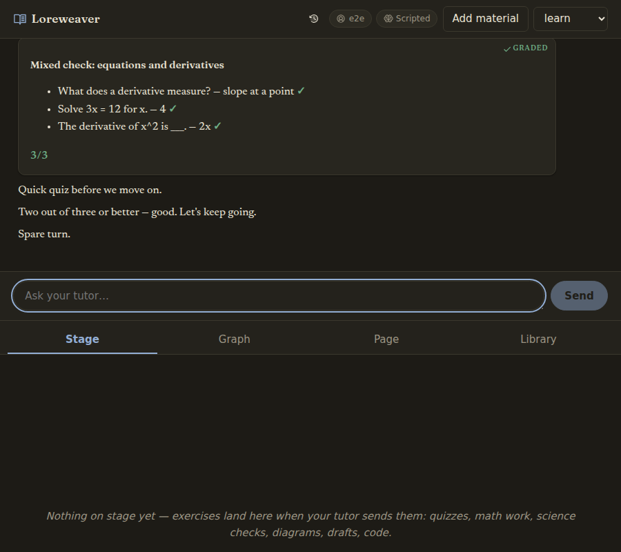

# Loreweaver

**A learn-anything desktop tutor that refuses to lie about what you know.**

[](https://github.com/SabienNguyen/loreweaver-harness/actions/workflows/ci.yml)

A chat tutor teaches through graded interactive blocks, a mastery graph tracks what you have
actually **proven**, and an evidence guardrail keeps the two honest: nothing counts as learned
without being graded and recorded, and a model's opinion can never mint the evidence a machine
check earns. Memory lives in [Loreweaver](https://github.com/SabienNguyen/loreweaver), an MCP
teaching-memory server that is the *only* writer of your notes and student files — the app talks
to it exclusively over stdio MCP.

| | |
|---|---|
|  |  |
| *First run: ask for anything — the tutor writes pages as you go.* | *A step-aware math scratchpad, graded mechanically.* |
|  |  |
| *The mastery graph: prerequisite edges, decay clocks, honest colors.* | *Per-item verdicts — ✗ stays ✗. Dark theme, narrow layout.* |

## Why it's different

- **Every subject gets an applied check.** Mechanical checkers for science and structured answers
  (numeric/unit algebra, chemical equations, sets, sequences, matching, note arithmetic), a
  step-aware math scratchpad (MathLive entry, numeric-equivalence grading that understands
  equation chains), diagram labelling for picture subjects, rubric'd writing drafts with a
  one-click revise round, and a built-in **code sandbox**: exercise ladders, generated exercises
  behind a review gate, and whole-program judging in ten runtimes (node, TypeScript, python3,
  bash, ruby, sqlite, C, Rust, CUDA where a toolkit exists; Go/Java via Docker) plus
  compose-backed service environments (redis, postgres).
- **Your material is the curriculum.** One *Add material* control ingests books and papers
  (PDF/EPUB/DOCX/MD), git repos (functions mined into exercises with your approval), YouTube
  lectures (the video's own captions become a timestamped, deep-linked transcript — needs
  `yt-dlp`, no video download), and problem sets or past exams — banked and drilled **verbatim**,
  never paraphrased. A source reader opens any artifact beside the conversation; select a passage
  to ask about it.
- **The tutor is a librarian first.** Live literature search (newest and most-cited), citation
  chasing through an ingested paper's own references, and prompt rules that route learning through
  real human artifacts — research claims must match what was actually read.
- **The loop closes visibly.** Spaced review with decay, an interleaved one-click session plan,
  misconception record → surface → repair → resolve (repair history kept), per-student profiles,
  and two-way Anki sync.

## Quick start

1. **Node ≥ 22**
2. `npm i`
3. `npm start`, open the app, and connect a way to reach Claude when it asks — your **Claude
   Pro/Max subscription** (via a local Claude Code login, no key involved) or an **Anthropic API
   key**.

That is the whole required setup. **There is no config file to write** — every field has a working
default (`src/server/config.ts`):

| | Default | Change it with |
|---|---|---|
| Vault | `~/Documents/Loreweaver` (created at boot) | `vault` |
| Student id | your OS username | `student` |
| Models | Sonnet for tutor/quiz/compile, Haiku for grader/card_gen | `models.*.model` |
| Loreweaver server | found automatically: installed dependency, then a sibling checkout | `LOREWEAVER_ENTRY`, or `loreweaver.command`/`args` |
| Port | 4820 | `port` |

Anything you do want to change goes in `harness.config.json` — copy
`harness.config.example.json` and delete everything you are not overriding; partial files are fine
and untouched fields keep their defaults. The boot log names every path it resolved, so a wrong
path shows up immediately rather than as a broken feature later.

<details>
<summary><b>Where the API key lives (and why not in the vault)</b></summary>

Anthropic-routed model roles need a key. The app asks on first run, checks it against Anthropic
before saving (a wrong key fails at the prompt, not mid-lesson), and stores it in your OS config
directory — `~/.config/loreweaver/credentials.json`, `~/Library/Application Support/Loreweaver/`
on macOS, `%APPDATA%\Loreweaver\` on Windows — **not** in the vault, since vaults get synced and
pushed. `ANTHROPIC_API_KEY` in the environment always wins over the saved key. A fully `ollama:`
or `claude-sdk:` setup is never asked for a key.
</details>

### Optional extras

- **Anki** — install [AnkiConnect](https://ankiweb.net/shared/info/2055492159) (code
  `2055492159`); the harness treats "Anki closed" as a normal state and syncs when it's back.
- **Better search (embeddings)** — on by default and degrades quietly: without Ollama, semantic
  search falls back to lexical matching. For the real thing: `ollama pull nomic-embed-text`.
- **YouTube ingest** — `pipx install yt-dlp` (captions only; a caption-less video gets an honest
  error, not a fake transcript).

## Model routes: subscription, API key, or local

Every `models.*.model` id is routed by prefix, so a config can freely mix routes per role:

| Prefix | Route | Billing |
|---|---|---|
| *plain id* (`claude-sonnet-5`) | Anthropic API | `ANTHROPIC_API_KEY` |
| `claude-sdk:sonnet` | [Claude Agent SDK](https://code.claude.com/docs/en/agent-sdk/typescript) via your machine's Claude Code login | your Claude Pro/Max subscription — **no key** |
| `ollama:qwen2.5-coder:14B` | local Ollama (OpenAI-compatible endpoint) | free, local |

Recommended split for local mixing: keep `tutor` and `compile` on Claude (they need the strongest
reasoning and tool use); route `grader`, `quiz_gen`, `card_gen` to a local model — higher-volume,
lower-stakes calls a good local model handles fine.

<details>
<summary><b>Ollama caveats: context length and leaked chat-template tokens</b></summary>

Ollama's runtime default context window is 4096 tokens regardless of what the model supports —
too small for this harness's prompts. Raise it on the Ollama service:
`OLLAMA_CONTEXT_LENGTH=32768` (systemd: `systemctl --user edit ollama`, add
`Environment=OLLAMA_CONTEXT_LENGTH=32768` under `[Service]`, restart). `OLLAMA_BASE_URL`
overrides the default `http://localhost:11434/v1`.

A degenerate local model can echo raw ChatML control tokens (`<|im_start|>assistant`, …) as
literal chat text; the harness scrubs these at render (`scrubModelArtifacts` in
`src/client/lib/panelBus.ts`).
</details>

<details>
<summary><b>How the tutor runs on the Agent SDK (the <code>claude-sdk:</code> chat path)</b></summary>

Setting `models.tutor.model` to a `claude-sdk:` id routes the interactive tutor through
`src/server/claudeSdkTutor.ts` instead of the AI-SDK `ToolLoopAgent` path in
`src/server/session.ts` — picked at server construction in `chatRoute.ts`. It streams the same
UIMessage chunk shapes the chat client already understands, so no client changes are needed.

- **Blocks pause the turn via an MCP sentinel**, not a real pause primitive: the graded blocks are
  registered as an in-process MCP server whose handler tells the model to end its turn; the
  student's answer arrives as the next chat message, exactly like the ai-sdk path.
- **Session continuity uses SDK session resume**, not transcript replay:
  `vault/.harness/sdk-sessions.json` maps `threadId → sdkSessionId`; a failed resume falls back to
  a fresh session seeded with rebuilt bootstrap context and logs loudly to stderr.
- **Streaming** uses `includePartialMessages` for live text; complete `assistant` messages carry
  tool-call input (partial JSON deltas aren't useful to a UI that needs the whole object).
- **Argument sanitization** (forcing the configured student id, repairing hallucinated slugs) runs
  through a `PreToolUse` hook's `updatedInput` — verified against a live subscription login;
  `canUseTool` is shadowed on this path (the SDK's own `CLAUDE_SDK_CAN_USE_TOOL_SHADOWED` warning
  names the fix).
- **Known gap:** the research tools (`web_search`/`read_url`, `ingest_paper`) are not wired on
  this path yet; everything else freeform mode offers is.
</details>

## Desktop app

`npm run dist` produces a single downloadable file — an AppImage on Linux, a dmg on macOS, an NSIS
installer on Windows — that runs with nothing installed and no config to write. It bundles both
repos: the harness serves its own built client, and Loreweaver rides along as an unpacked resource
spawned over stdio exactly as in development.

```bash
npm run dist            # build:all + bundle:loreweaver + electron-builder
npm run desktop         # same shell against the dev tree, no packaging
```

The renderer is a plain web client — no preload, no node integration, `sandbox: true` — because it
talks to the local server over HTTP like any browser would.

<details>
<summary><b>Three packaging decisions that were each a bug before they were a comment</b></summary>

- **`ELECTRON_RUN_AS_NODE=1` on the Loreweaver child** (`src/server/mcp.ts`): inside the packaged
  app, `process.execPath` is the Electron binary — spawning it plainly opens a second app window.
- **Loreweaver is copied in an `afterPack` hook**, not `extraResources`: electron-builder strips
  `node_modules` from extra resources, and the shipped server imports
  `@modelcontextprotocol/sdk` at runtime — the extraResources version packaged cleanly, launched,
  and died with `ERR_MODULE_NOT_FOUND`. It also lives outside the asar archive because Node
  cannot spawn a script from inside one.
- **`scripts/bundle-loreweaver.mjs` installs runtime deps from the lockfile** rather than copying
  the dev checkout's `node_modules` — copy-then-prune left typescript, vitest and rollup in the
  download.

`tests/packaging.test.ts` pins all three as static checks, so a config edit that would
reintroduce one fails in seconds instead of at the end of a 230MB build.

**Not yet done:** no application icon, no code signing or notarization, no auto-update channel.
Only the Linux AppImage has been built and launched here; mac and win targets are configured but
unverified.
</details>

## Running from source

**Dev** (two processes, hot reload):
```bash
npm run dev:server   # Hono + AI SDK agent loop + Loreweaver MCP client, :4820
npm run dev:client   # Vite dev server, :5173
```

**Production-ish** (single machine, no reload):
```bash
npm run build                       # vite build -> dist/
npm start                           # the backend, :4820
npx vite preview --port 4173        # serves dist/; inherits the /api proxy
```

**As a systemd user service:**
```bash
cp systemd/loreweaver-harness.service ~/.config/systemd/user/
systemctl --user daemon-reload
systemctl --user enable --now loreweaver-harness
```

### The coding sandbox

**Code exercises work out of the box.** The harness ships a built-in sandbox (`src/server/gap/`):
an exercise ladder plus a grader that runs submissions in a spawned child process with a hard
wall-clock kill — an unbounded loop in learner code dies at 6s instead of hanging the tutor.
Nothing to install; the starter pattern page is seeded at boot, and the Library's *Practice*
section lists each pattern with an owned/rented/new badge derived from the student model.

An external sidecar with more patterns can be pointed at via `gap.url` in `harness.config.json`;
a configured url takes precedence over the built-in sandbox. Either way the tutor UI is the one
place to learn — the sandbox only serves ladders and runs tests for it.

## Tests

```bash
npx tsc --noEmit    # typecheck
npx vitest run      # 900+ unit + integration tests (incl. seeded fuzz suites)
npm run e2e         # Playwright, 6 specs against a scripted model
```

The e2e suite spins up the real backend and a real Loreweaver server (fake embeddings, disposable
fixture vaults) with the tutor replaced by a scripted model, then drives the built SPA with a real
browser: the full tutor loop (quick_check → grade → evidence on disk), the whole coding flow
(predict gate → editor → real tests → evidence), the exercise Help tab, the contextual graph,
conversation history (restore, switch, APG keyboard menu), and video ingest (a fake `yt-dlp`
serves captions with no network). On a machine that ships a pinned Chromium:
`PLAYWRIGHT_CHROMIUM_PATH=/opt/pw-browsers/chromium npm run e2e`.

**CI** runs on every push: typecheck and the client component suite unconditionally; the
integration and e2e suites unlock when a `LOREWEAVER_CI_TOKEN` secret (read access to the
loreweaver repo) exists — until then CI stays green on the ungated steps and prints a warning
naming the missing secret.

## The evidence model, in five lines

1. Mastery levels: `unseen → exposed → practicing → mastered` — they change **only** through
   `record_evidence`, never by presenting material, never promoted from mere recall.
2. Mastery **decays**: `mastered` needs reinforcement within 45 days, `practicing` within 21, or
   the *effective* level drops a rung (raw level kept for history).
3. Evidence kinds: `exposed`, `explained-correctly`, `applied-correctly`, `struggled`,
   `misconception` (with a note) — and a machine check outranks a model's opinion.
4. Anki reviews have a ceiling: a review maps to `exposed` (refreshes the decay clock, never
   promotes); a lapse maps to `struggled`. Flashcards alone can never mint `applied-correctly`.
5. If a graded block isn't followed by a `record_evidence` call, the guardrail nudges the tutor
   once, then logs to `vault/.harness/guardrail.log`.
